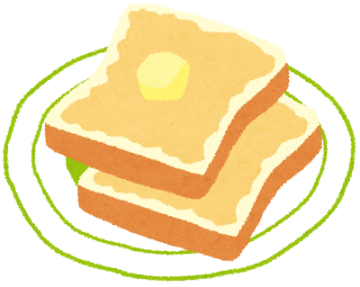

# 食パンの作り方

※ 文章は generated by chat-gpt

---

## 材料
- 強力粉: 300g
- ドライイースト: 5g
- 砂糖: 15g
- 塩: 5g
- 牛乳: 200ml
- バター: 20g

---

# 作り方

---

# 作り方
## 1. 材料を準備する

強力粉、ドライイースト、砂糖、塩、牛乳、バターを計量し、すべて揃える。

---

## 2. イーストを活性化させる

牛乳を40℃程度に温め、ドライイーストを加えて5分ほど置き、イーストを活性化させる。

## 3. 生地をこねる

ボウルに強力粉、砂糖、塩を入れ、そこにイーストを混ぜた牛乳を加え、生地がまとまるまでこねる。

---

## 4. バターを加える

生地がまとまってきたら、室温で柔らかくしたバターを加え、さらに10分ほどこねる。

